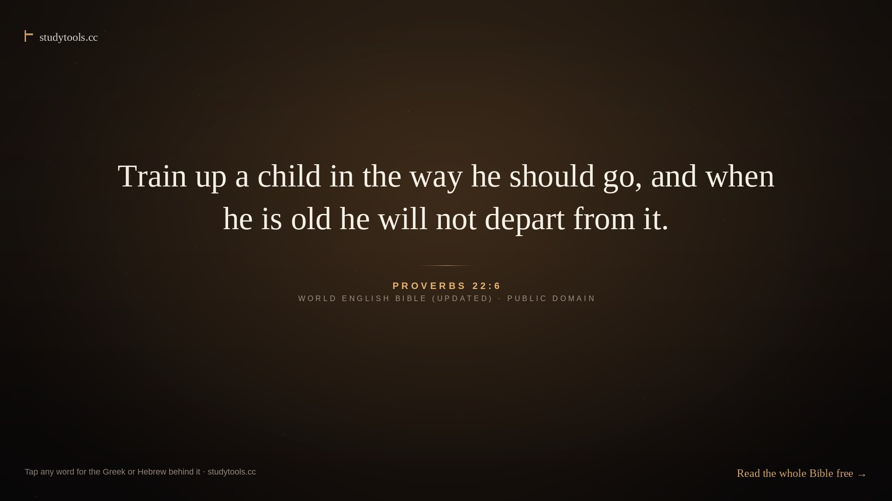

# Scripture — a studytools.cc live wallpaper

**Christ in the background.** A quiet loop of Scripture for a desktop, and a
playground when you touch it. One HTML file, no server, no account, no
network calls — and every verse, every word and every tool in it comes from
**[studytools.cc](https://studytools.cc)**.



Left alone it drifts: a verse, its reference, the clock, the site's name, a
warm glow in a near-dark room. Move the mouse and a bar appears — this is where
it stops being a screensaver:

| | |
| --- | --- |
| **Behind the words** | Tap any underlined word and the Greek or Hebrew behind it opens: the word, its transliteration, its Strong's number, its morphology, its gloss — and a link to every verse it appears in. *Psalm 23:1* → **רָעָה ra.ah, H7462, to pasture**. *John 3:16* → **ἠγάπησεν ēgapēsen, G25, aorist active indicative, to love**. |
| **Memory** | The verse blanks out word by word. Tap the blanks to test yourself; *I have it* marks it learnt and the reference keeps a ✓. |
| **Catechism** | Westminster Shorter (106) and Heidelberg (129). Question first, tap for the answer; *Today's* gives the day's own. |
| **Grow** | The nine fruit of the Spirit and the six pieces of the armour of God — tap one to begin it today, with its verse and one place to start. |
| **Play** | Five rounds of five: finish the verse, which book is it from, Old or New, **which translation is this**, and **what does this Greek or Hebrew word mean**. Streak and best score kept. |
| **Pray** | Light a candle for the night, take up the day's challenge, pray a minute against the clock, and see where today falls in the church's year — *Trinity 17*, *Ash Wednesday*, *The Eve of St. Michael and All Angels*. |
| **Amen** | `A`. Sparkles. That's all it does. |

It remembers your days here, your streak, verses read, verses learnt, candles
lit, challenges kept and catechism answers learnt — in your own browser,
on your own device, under the key `studytools.screensaver.v1`.

## Install

Pick whichever suits the machine. Everything below is built by
[the workflow](.github/workflows/build.yml) — see **Releases** for the files,
or **Actions** for the newest build.

| System | File | What to do |
| --- | --- | --- |
| **Windows** | `Scripture-studytools-Lively-1.0.0.zip` | Install [Lively Wallpaper](https://github.com/rocksdanister/lively) (free), drag the zip into its window, pick it. The mouse still works, so the words stay tappable on the desktop. |
| **Windows** (Steam) | `Scripture-wallpaper-engine-1.0.0.zip` | Unzip into `wallpaper_engine/projects/myprojects/`, open it in Wallpaper Engine, and turn on *mouse input* if you want to touch it. |
| **Debian / Ubuntu / Mint** | `studytools-wallpaper_1.0.0_all.deb` | `sudo apt install ./studytools-wallpaper_1.0.0_all.deb` then run **Scripture on the desktop** from the menu, or `studytools-wallpaper`. |
| **Fedora / RHEL / openSUSE** | `studytools-wallpaper-1.0.0-1.noarch.rpm` | `sudo dnf install ./studytools-wallpaper-1.0.0-1.noarch.rpm` (or `zypper in`), then the same. |
| **any Linux** | `StudyTools-Wallpaper-1.0.0-x86_64.AppImage` | `chmod +x`, run it. No install, nothing written outside your home folder. |
| **macOS** | `Scripture-portable-1.0.0.zip` | Install [Plash](https://github.com/sindresorhus/Plash) (free), *Add Website → Load from file*, choose `studytools-screensaver.html`. |
| **anything else** | `Scripture-portable-1.0.0.zip` | Double-click `studytools-screensaver.html`, press `F`. Phone, tablet, Chromebook, a TV browser — it all works, the layout is built for small screens. |

There is also `studytools-loop-1080p.mp4` — the same verses as a silent
96-second video loop, for anything that wants a video rather than a web page
(GNOME's *Live Wallpaper* extension, `mpvpaper`, a KDE video wallpaper,
Wallpaper Engine's video type, a lock screen).

### On Linux, what actually works

The launcher tries the best thing your session can do, and says so when it
can't:

```sh
studytools-wallpaper                # on the desktop, best method for this session
studytools-wallpaper --screensaver  # full screen, like a screensaver
studytools-wallpaper --video        # the video loop (mpvpaper, or xwinwrap + mpv)
studytools-wallpaper --stop         # take it down
studytools-wallpaper --where        # where the page and the loop live
studytools-wallpaper --dry-run      # say what it would run, and run nothing
```

- **X11** — with [`xwinwrap`](https://github.com/mmhobi7/xwinwrap) it is a true
  desktop window. Without it, the launcher keeps an ordinary window below
  everything else with `wmctrl` and tells you to install xwinwrap for the real
  thing.
- **Wayland (GNOME)** — a compositor won't let a web page sit on the desktop.
  Use the **Live Wallpaper** extension (mpv-based) with the video loop:
  `studytools-wallpaper --video`.
- **Wayland (KDE Plasma)** — the *Wallpaper Engine KDE Plugin* takes web
  wallpapers; point it at the Wallpaper Engine zip. Or use the video loop.
- **Any** — `--screensaver` is full screen and works everywhere a browser does.

The page itself is copied once into
`~/.local/share/studytools/scripture/` — so you can edit it, and so it keeps
working when a package is upgraded.

## Keys

| Key | |
| --- | --- |
| `←` `→` | previous / next verse |
| `space` | pause |
| `1`–`6` | words · memory · catechism · grow · play · pray |
| `W` `M` `C` `V` `G` `P` | the same six |
| `A` | Amen |
| `Esc` | close the panel |
| `F` | full screen |
| `H` | hide the clock, the taglines and the bar |

## Options you can add to the address

`…index.html?only=nt&hold=30&theme=light`

| Option | |
| --- | --- |
| `hold=30` | seconds each verse stays (default 24) |
| `only=nt` · `only=ot` | only the New Testament, or only the Old |
| `shuffle=1` | a different order every time |
| `start=12` · `start=John 3:16` | where to begin |
| `theme=light` | for a bright desktop |
| `round=word` | `finish` · `book` · `testament` · `translation` · `word` — ask only that sort of question |
| `quiet=1` | hands off: purely a background |
| `bare=1` | the verse alone: no clock, no taglines, no bar |
| `still=1` | nothing moves at all — screenshots, e-ink, a still panel |
| `panel=words` | open that panel at start: `words`, `memory`, `catechism`, `grow`, `play`, `pray` |
| `site=https://example.org/` | point every link somewhere else |

## What is in it, and where it came from

All of it is public domain, and all of it is what studytools.cc already holds:

- **The verses** — 120 of them, the World English Bible (Updated), eBible.org.
- **The Greek and Hebrew** — OpenGNT with its glosses, and the Open Scriptures
  Hebrew Bible with STEPBible's glosses: 2,016 words with transliteration,
  morphology, Strong's number and gloss.
- **The catechisms** — Westminster Shorter (1640s) and Heidelberg.
- **The church's year** — the Book of Common Prayer (1928) tables: Easter by
  the usual computus, the Sundays and the feast days named as the Prayer Book
  names them. The arithmetic is the same code the site runs, checked against
  it day by day from 2019 to 2036.
- **The vocabulary** — the site's top-frequency Greek and Hebrew words, for
  the word quiz.

### Christian only

The verse pool is the Christian canon, Old and New Testament, and that is all
the wallpaper quotes or links. studytools.cc also carries the Apocrypha, and in
its *Parallel Passages* tool the Qur'an, the Tanakh and the Book of Mormon for
comparison; none of that is in here. `?only=nt` or `?only=ot` narrows it
further.

## Building it

```sh
./build.sh                # wallpaper + icon + video loop + every package
```

or by hand:

```sh
python3 tools/make-wallpaper.py dist/index.html   # src/template.html + src/data.json + src/year.js
python3 tools/make-icon.py                        # the icon
python3 tools/make-video.py --count 12 --seconds 8  # the 1080p loop, thumbnail, preview.gif
bash tools/make-packages.sh                       # .deb, .rpm, .AppImage, the Windows zips
```

Needs `python3` with `Pillow`, `ffmpeg`, and for packages `dpkg-deb` (deb),
`rpmbuild` (rpm) and `curl` (to fetch `appimagetool` once).

### Refreshing the data

`src/data.json` is generated from a checkout of the studytools.cc source, so
that the wallpaper and the site can never drift apart:

```sh
python3 tools/make-data.py --studytools /path/to/StudyTools --out src/data.json
```

That reads the site's own `data/bible/`, `data/interlinear/`,
`data/catechism/`, `data/vocab/` and `data/liturgical/` files. The verse pool
lives in `tools/make-data.py` (`REFS`) — add to it and rebuild.

## Layout

```
src/template.html        the wallpaper: one file, everything inline
src/year.js              the church's year, lifted from the site's js/liturgy.js
src/data.json            verses, interlinear, catechisms, vocabulary, feasts
tools/make-data.py       rebuild src/data.json from a StudyTools checkout
tools/make-wallpaper.py  assemble the single-file page
tools/make-video.py      render the 1080p loop (Pillow → ffmpeg)
tools/make-icon.py       the icon
tools/make-packages.sh   deb, rpm, AppImage, Windows zips, SHA256SUMS
packaging/linux/         the launcher, .desktop entries, rpm spec, deb copyright
packaging/windows/       Lively Wallpaper and Wallpaper Engine manifests
.github/workflows/       build, Pages, and releases on tags
```

## Continuous integration

Push to `main` and the workflow builds the wallpaper, the icon, the video loop
and all six packages, uploads them as artifacts, and publishes the page to
GitHub Pages. Tag a release (`git tag v1.0.0 && git push --tags`) and the same
build is attached to a GitHub Release.

**One-time setup:** in *Settings → Pages*, set **Source: GitHub Actions**. That
is all the repository needs.

## Licence

MIT for the code — see [LICENSE](LICENSE). The Scripture is public domain; the
Greek, Hebrew and vocabulary carry the licences of OpenGNT, the Open Scriptures
Hebrew Bible and STEPBible, and the Prayer Book tables are public domain.
Nothing here is affiliated with any of those projects; it is a wallpaper that
points at [studytools.cc](https://studytools.cc), which serves them all.
